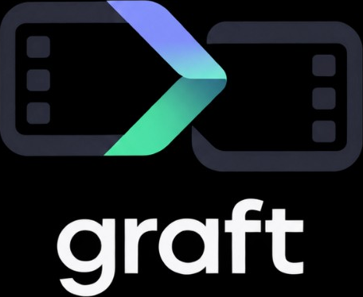

[](https://github.com/eonik-ai/graft/actions/workflows/ci.yml)
[](LICENSE)

<h1 align="center">
  
</h1>

graft is a compiler for video composition.

The score is source. Essence is immutable. The mp4 is a compile.
You graft a new hook. The body stays.

This repository is **spec-first**. The JSON Schema, the worked example, and the
reference signal→dirty test *are* the north star. A CLI that encodes video is
on the [roadmap](docs/roadmap.md); it is not in-tree yet.

[Apache-2.0](LICENSE) · [mission](docs/mission.md) · [principles](docs/principles.md) · [schema](schema/)

## Why

Video teams already version *files*. They need to version *slots*.

- One concept fans into many scions (`hook_v3 + body_v1 @ 9:16`).
- A platform signal (“hook rate on 0–3s”) must address a named slot, not a byte range of a re-exported H.264 file.
- Changing the hook must not recut the body. That is a compiler cache problem, not a git-on-mp4 problem.

git is the wrong metaphor for pixels. git is the right tool for the **score**.
IMF already does this algebra for finished masters (CPL + Track Files).
graft does it for authoring: named slots, variants, a time map, and an incremental compile.

## Status

| Piece | State |
| --- | --- |
| Mission, principles, ADRs | encoded |
| Score / scion / time-map schema | `0.1.0` |
| Worked example `hook_v3 + body_v1 + cta_v1 @ 9x16` | `examples/hook-v3-body-v1-9x16/` |
| Signal → dirty-set reference | `ref/` (tested) |
| `graft` CLI / encoder | not started — see [roadmap](docs/roadmap.md) |

Pre-1.0: the schema may change. Breaking schema changes are always an RFC.

## Prerequisites

- Python 3.10+ (reference tests and schema checks only)

## Quick start

```sh
git clone https://github.com/eonik-ai/graft.git
cd graft
make test
```

That validates every schema and example, then runs the north-star test:
a `hook_rate` signal on `[0, 3)` dirties `hook` and the `hook→body` kerf,
and leaves `body_v1` clean.

## What graft is not

- Not git-on-pixels. Do not xdelta a delivery mp4.
- Not a lossless round-trip to every NLE. Adapters are guests; loss is documented.
- Not a lock server, a DAM, or a review tool. Those are other jobs.
- Not an agency workflow product. The IR is universal; products sit on top.

## Intended command surface

These commands are the contract. They do not run yet.

```text
graft init
graft slot hook --window 0-3
graft bind hook ./hooks/v3.mov
graft scion 9x16 --dest 1080x1920
graft compile
graft dirty
graft signal --kind hook_rate --t 0-3
graft export otio|fcpxml|imf|mp4
```

## Documentation

| Doc | What it settles |
| --- | --- |
| [docs/mission.md](docs/mission.md) | Why graft exists |
| [docs/principles.md](docs/principles.md) | Non-negotiables and non-goals |
| [docs/glossary.md](docs/glossary.md) | score, slot, scion, kerf, dest |
| [docs/architecture.md](docs/architecture.md) | Three delta layers, device vs server |
| [docs/schema.md](docs/schema.md) | Commentary on the normative JSON Schema |
| [docs/compile.md](docs/compile.md) | Cache keys, grain, smart concat |
| [docs/time-map.md](docs/time-map.md) | How a metric addresses a slot |
| [docs/adapters.md](docs/adapters.md) | Loss matrix |
| [docs/comparison.md](docs/comparison.md) | git, OTIO, IMF, Vit, Aspect |
| [docs/roadmap.md](docs/roadmap.md) | 0.1 → 1.0 |
| [docs/adr/](docs/adr/) | Decisions already made |

Normative machine contract: [`schema/`](schema/).

## Contributing

Please read [CONTRIBUTING.md](CONTRIBUTING.md). Schema changes need an RFC.
All commits require a Developer Certificate of Origin (`Signed-off-by`).
Be kind: [CODE_OF_CONDUCT.md](CODE_OF_CONDUCT.md).

## License

Copyright 2026 [eonik](https://www.eonik.ai/) ([github.com/eonik-ai](https://github.com/eonik-ai)).

Licensed under the [Apache License, Version 2.0](LICENSE).
The patent grant is why this project is Apache-2.0, not MIT.
Contributors are first-class: there is no CLA and no copyright assignment.
You keep copyright on your patches; DCO + Apache §5 license them inbound.
See [NOTICE](NOTICE) and [CONTRIBUTING.md](CONTRIBUTING.md).
