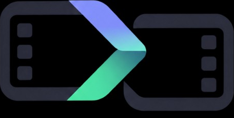

<div align="center">
  <a href="https://github.com/eonik-ai/graft"></a>
  <h1>graft</h1>
  <p><strong>Меняйте hook. Сохраняйте body.</strong></p>
  <p>
    <a href="README.md">English</a> ·
    <a href="README.es.md">Español</a> ·
    <a href="README.pt-BR.md">Português</a> ·
    <a href="README.fr.md">Français</a> ·
    <a href="README.zh-CN.md">简体中文</a> ·
    <a href="README.ja.md">日本語</a> ·
    <a href="README.ko.md">한국어</a> ·
    <a href="README.de.md">Deutsch</a> ·
    <strong>Русский</strong>
  </p>
</div>

---

score — источник. essence неизменна. mp4 — результат компиляции.
Подставляете новый hook. body остаётся.

git версионирует **score** (JSON). CAS версионирует essence. action cache
версионирует кодирования, поэтому смена hook копирует body битстримом.
graft — не NLE. Среда выполнения — **ffmpeg** и **ffprobe** в `PATH`.


_Настоящий локальный сеанс, записанный с [asciinema](https://github.com/asciinema/asciinema).
Исходник воспроизведения — [`landing.cast`](docs/assets/landing.cast)._

## Начало работы

### Требования

graft вызывает системный ffmpeg; GPL x264 не линкуется. Rust 1.85+ (`rustup`).
`$FFMPEG` / `$FFPROBE` подменяют двоичные файлы из `PATH`.

### Установка

```sh
cargo install --git https://github.com/eonik-ai/graft.git --locked --bin graft
graft --help
```

Двоичные файлы GitHub Release (когда будет срезан тег `v0.2.*`): macOS arm64
и Linux x64. crates.io ещё не опубликован (`publish = false`).

Из клона:

```sh
git clone https://github.com/eonik-ai/graft.git
cd graft
make test
cargo run -- -C examples/hook-v3-body-v1-9x16 signal --kind hook_rate --t 0-3
```

Рабочий пример — только JSON (заглушки хешей, в git нет медиа).
`graft compile` там печатает **plan**. Ваши клипы компилируются в mp4.

### Запустить первую компиляцию

```sh
mkdir ad && cd ad
graft init
graft slot body --span 3-20
graft slot cta --span 20-23 --role cta
graft scion 9x16 --dest 1080x1920 --encoder x264
graft bind hook ./hook.mov
graft bind body ./body.mov
graft bind cta ./cta.mov
graft compile --out ad.mp4
```

Воспроизведите `ad.mp4`. Заново привяжите hook и скомпилируйте ещё раз:
`graft dirty` показывает `body` **hit**. Кодирование body копируется битстримом.
dest — продукт линковщика, никогда не essence.

```sh
graft signal --kind hook_rate --t 0-3
```

печатает `{hook}` и kerf hook→body, не `body`.

Сейчас не поддерживается: speed/retime, наложение слоёв, звук, экспорт в NLE.
`params.speed` меняет только action key.

## Состояние проекта

| Часть | Состояние |
| --- | --- |
| Mission, principles, ADR | записаны |
| Score / scion / time-map schema | format id `0.1.0` |
| Signal → dirty-set (`hook_rate` не dirty-ит body) | `ref/` + Rust |
| Action graph + action cache | `graft-compile` / `graft-cas` |
| Кадр как зерно (`graft-intra`) | в дереве; dest — `GFI1`, не файл плеера |
| Long-GOP x264 mp4 | системный ffmpeg; closed-GOP файлы slot; concat `-c copy` |
| Адаптеры NLE / preview / S3 | не в этом выпуске |

format id `0.1.0` у schema — не версия crate. Первый GitHub-тег компилятора —
`v0.2.0` (не используйте повторно spec-тег `v0.1.0`). Ломающие изменения
schema идут через RFC.

## Чем graft не является

- Не git по пикселям. Не делайте xdelta готового mp4.
- Не lossless туда-обратно в каждый NLE. Адаптеры — гости; потери задокументированы.
- Не сервер блокировок, не DAM и не инструмент ревью.

Соседи (git, OTIO, IMF, ffmpeg concat) — в [docs/comparison.md](docs/comparison.md).

## Поверхность команд

```text
graft init
graft slot hook --window 0-3
graft bind hook ./hooks/v3.mov
graft scion 9x16 --dest 1080x1920 --encoder x264
graft compile --out ad.mp4
graft dirty
graft signal --kind hook_rate --t 0-3
```

`export` не реализован. `--encoder graft-intra` — бэкенд покадрового зерна
(тесты / image-seq), не dest QuickTime.

## Следующие шаги

Документация для реализаторов на английском. [Переводы этого README](docs/TRANSLATING.md).

| Документ | Что фиксирует |
| --- | --- |
| [docs/mission.md](docs/mission.md) | Зачем существует graft |
| [docs/principles.md](docs/principles.md) | Непереговорное и не-цели |
| [docs/glossary.md](docs/glossary.md) | score, slot, scion, kerf, dest |
| [docs/architecture.md](docs/architecture.md) | Слои, граф crate, конвейер compile |
| [docs/schema.md](docs/schema.md) | Комментарий к нормативному JSON Schema |
| [docs/compile.md](docs/compile.md) | Ключи кэша, grain, smart concat |
| [docs/time-map.md](docs/time-map.md) | Как метрика адресует slot |
| [docs/adapters.md](docs/adapters.md) | Матрица потерь |
| [docs/comparison.md](docs/comparison.md) | git, OTIO, IMF, Vit, Aspect |
| [docs/roadmap.md](docs/roadmap.md) | Работа впереди |
| [docs/brand/](docs/brand/) | Знак: два клипа, одно соединение |
| [docs/adr/](docs/adr/) | Уже принятые решения |

Нормативный машинный контракт: [`schema/`](schema/).

## Участие

Прочтите [CONTRIBUTING.md](CONTRIBUTING.md). Изменения schema требуют RFC.
Каждый коммит нуждается в Developer Certificate of Origin (`Signed-off-by`).
Будьте доброжелательны: [CODE_OF_CONDUCT.md](CODE_OF_CONDUCT.md).

## Лицензия

Copyright 2026 [eonik](https://www.eonik.ai/) ([github.com/eonik-ai](https://github.com/eonik-ai)).

Лицензировано по [Apache License, Version 2.0](LICENSE).
Патентный грант — причина Apache-2.0, а не MIT.
Участники — первого класса: нет CLA и нет уступки авторских прав.
Вы сохраняете авторские права на свои патчи; DCO и Apache §5 лицензируют их внутрь.
См. [NOTICE](NOTICE) и [CONTRIBUTING.md](CONTRIBUTING.md).
